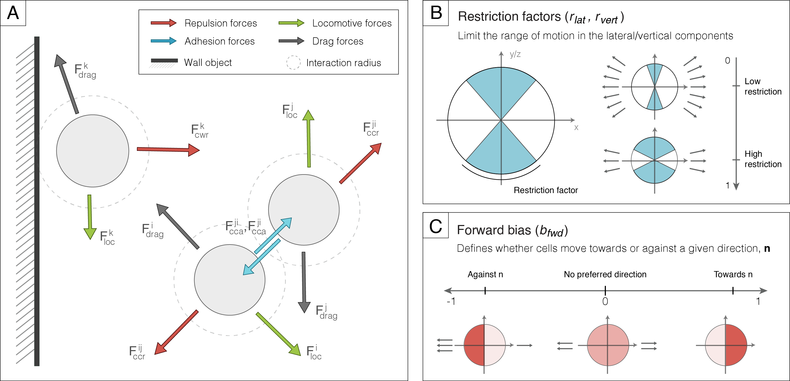

# PhysiCell-based PDGF chemotaxis model

The computational model was designed with PhysiCell (version 1.8.0), and [our previously developed ECM extension](https://github.com/m2be-igg/PhysiCell-ECM). In addition, the model was extended to provide more control over the migration patterns in 3D.

We offer the possibility to **restrict the lateral and vertical components independently**. This allows us to simulate the behaviour of cells embedded in 3D matrices that mostly favour 2D movement but still have a small 3D component. In addition, we model cell motility to **follow a given 2D direction**, with the ability to choose whether to **move towards or against this direction**, or adopt a random behaviour in regards to this decision. Cells may also **stray away from this direction in the lateral component**, based on a restriction factor.

Furthermore, **we model cell forces magnitudes based on a [Rayleigh distribution](https://en.wikipedia.org/wiki/Rayleigh_distribution)** and, to do so, we created a generator function that outputs new magnitude values based on this distribution and a given scale parameter ($\sigma$).

With this in mind, our extension relies on four new cell components, added to the `Phenotype::Motility` PhysiCell class. These are used to compute the new direction of movement at every velocity update by the `Cell::update_motility_vector()` function.

- `vertical_restriction`: defines how much cells are able to stray away from z=0, in the vertical component

  - for high restriction values, the cells adopt purely 2D migration patterns
  - for low restriction values, cells have more freedom to move in 3D. The degree of freedom is dictated by the restriction factor.

- `forward_angle`: defines the direction that the cell will foloow or move away from (e.g., a chemoattractant)

  - if the `migration_bias` (see PhysiCell's documentation) feature is active, the forward_angle will be set based on this gradient

- `lateral_restriction`: defines how much cells are able to stray away from the forward_angle, in the lateral component

  - for high restriction values, the cells always follow this direction
  - for low restriction values, cells have more freedom to stray away from the forward_angle direction

- `forward_bias`: defines whether cells move towards or away from the direction defined by forward_angle

  - for forward_bias values close to 1, cells always move towards this direction
  - for forward_bias values close to 0, cells always move away from this direction
  - for forward_bias values close to 0.5, cells have a 50% chance to either move towards or against this direction

- `sigma`: defines the Rayleigh distribution used to generate new magnitude values for the cell-generated locomotive forces;



## Running our model

**We provide all the necessary files to compile and run our model**. To compile the model, run `make`. Afterwards, the executable file (named `project` or `project.exe`, depending on your operating system) can be run independently, or it can be integrated into our optimization framework.

**To run the analysis we made for this study, all of the changes can be made through the `PhysiCell_settings.xml` file**, which allows you to update the model parameter values. When changes are made to only this file, there is no need to recompile the project. However, if you want to make further changes to the code provided in the `custom` and `core` files, you will need to recompile the project for the changes to be applied.

## Understanding our extension

This section aims to **explain how our extension was implemented in the PhysiCell code**. To do this, we show which files were changed and the new additions to the code.

### Extending the `Phenotype::Motility` to add the factors that regulate cell directionality

New components were added to the `Phenotype::Motility` class to enable **vertical** and **lateral restriction**. Cells can now also favour movement towards or against a given angle, defined as **forward_angle**. The probability of moving towards this angle is given by **forward_bias**.

You can find the new changes to these components in the `PhysiCell_phenotype.h` and `PhysiCell_phenotype.cpp` files. To illustrate the extension, we present the new code in `PhysiCell_phenotype.h`, but variables should be initialized in the corresponding .cpp file.

```cpp
Motility::Motility()
{
class Motility
{
public:
 bool is_motile;
 double persistence_time;
 double migration_speed;
 std::vector<double> migration_bias_direction;
 double migration_bias;

 // ----EXTENSION STARTS HERE-------
 double vertical_restriction;
 double lateral_restriction;
 double forward_bias;
 double forward_angle;
 // ----EXTENSION ENDS HERE-------

 bool restrict_to_2D;
 std::vector<double> motility_vector;
 int chemotaxis_index;
 int chemotaxis_direction;

 Motility();
};
}
```

### Extending the `Cell::update_motility_vector()` to take the new factors into account

The new components are used to **update the motility vector** at time intervals given by the persistence time.

You can find the new changes to these components in the `PhysiCell_cell.cpp` file:

```cpp
// Update the motility vector with the extended 3D movement function
void Cell::update_motility_vector( double dt_ )
{
if( phenotype.motility.is_motile == false )
{
 phenotype.motility.motility_vector.assign( 3, 0.0 );
 return;
}

// ----EXTENSION STARTS HERE-------

if( UniformRandom() < dt_ / phenotype.motility.persistence_time || phenotype.motility.persistence_time < dt_ )
{

 // If the update_bias_vector function is set, use it
 if( functions.update_migration_bias )
 {
  // Define the forward angle as the angle that defines the migration_bias_direction
  functions.update_migration_bias( this,phenotype,dt_ );
  phenotype.motility.forward_angle = atan2(phenotype.motility.migration_bias_direction[1], 
                                           phenotype.motility.migration_bias_direction[0]);
 }

 double temp_angle;

 // Define movement towards the forward_angle direction
 if( UniformRandom()  < phenotype.motility.forward_bias ) {
  // Define the direction to follow in 2D:
  // a random value centered at forward_angle with a random component that depends on lateral_restriction
  temp_angle = 3.1415926535897932384626433832795*((1 - phenotype.motility.lateral_restriction)*UniformRandom()
               + (-0.5 + phenotype.motility.lateral_restriction/2)) + phenotype.motility.forward_angle;
 }
 // Define movement against the forward_angle direction
 else {
  // Define the direction to follow in 2D:
  // a random value centered at forward_angle with a random component that depends on lateral_restriction
  temp_angle = 3.1415926535897932384626433832795*((-1 + phenotype.motility.lateral_restriction)*UniformRandom()
               + (1.5 - phenotype.motility.lateral_restriction/2)) + phenotype.motility.forward_angle;
 }

 // Limit cell motility in the 3D component:
 // a random value centered at 0 with a random component that depends on lateral_restriction
 double temp_phi = 3.1415926535897932384626433832795*((1 - phenotype.motility.vertical_restriction)*UniformRandom()
                   + phenotype.motility.vertical_restriction/2);


// ----EXTENSION ENDS HERE-------

 double sin_phi = sin(temp_phi);
 double cos_phi = cos(temp_phi);

 if( phenotype.motility.restrict_to_2D == true )
 {
  sin_phi = 1.0;
  cos_phi = 0.0;
 }

 if( phenotype.motility.restrict_to_2D == true )
 {
  sin_phi = 1.0;
  cos_phi = 0.0;
 }

 std::vector<double> randvec;
 randvec.resize(3,sin_phi);

 randvec[0] *= cos( temp_angle ); // cos(theta)*sin(phi)
 randvec[1] *= sin( temp_angle ); // sin(theta)*sin(phi)
 randvec[2] = cos_phi; //  cos(phi)

 phenotype.motility.motility_vector = randvec;

 normalize( &(phenotype.motility.motility_vector) );

 phenotype.motility.motility_vector *= phenotype.motility.migration_speed;
}

return;
}
```

### Extending the force magnitude generator function and setting the cells' initial positions

The new components are used to **create a generator function based on a Rayleigh distribution to output force magnitude values** and to **initialize cells as a grid** placed on one of the walls of the domain, to reproduce simplified representation of a cell monolayer.  

You can find the new changes to these components in the `PhysiCell_custom.cpp` file:

```cpp
double locomotive_force_generator( )
{
 // random number generator to define cell velocities
 // based on a Rayleigh distribution

 double random_value, force_value;
 double sigma = parameters.doubles("sigma");
 
 random_value = UniformRandom();
 force_value = sigma * pow(-2 * log(random_value), 0.5);
 
 return force_value;
}
```

```cpp
void setup_tissue( void )
{
 Cell* pC;
 Cell_Definition* pCD = cell_definitions_by_index[0];

 // Create a grid on top of one of bounding walls to represent a cell monolayer
 // Set the boundaries of the grid
 double Xmin = -400;
 double Xmax = 400;
 double Ymin = microenvironment.mesh.bounding_box[1];
 double Ymax = microenvironment.mesh.bounding_box[4];
 double Zmin = -75;
 double Zmax = 75;

 // Set the spacing between each cell to create a grid with a offset in each row
 // This allows for cells to be more packed
 double cell_radius = pCD->phenotype.geometry.radius;
 double spacing = 2.0 * cell_radius * 2.0;
 double half_space = 0.5*spacing;
 double y_offset = sqrt(3.0)*half_space;
 int n = 0;

 // Set the position for the first cell
 double x = Xmin + cell_radius;
 double y = Ymin + cell_radius;
 double z = Zmin + cell_radius;

 // Go through the grid, adding a new cell at each position
 while( z <= Zmax - cell_radius )
 {
  while( x <= Xmax - cell_radius )
  {
   Cell* pC = create_cell( *pCD );
   pC->assign_position( x,y,z );
   x += spacing;
  }
  x = Xmin + half_space;
  z += y_offset;
  n++;
  
  if( n % 2 == 1 )
   { x += half_space; }
 }

 return;
}
```

### Extending the `PhysiCell_settings.xml` file to include the new model parameters

The new components are used to **update parameter values** without the need to recompile the model.

```xml
<user_parameters>
 <random_seed type="int" units="dimensionless">0</random_seed>
 <div_initialization type="divider" description="---Initialization settings---"/>

 <!-- EXTENSION STARTS HERE -->
 <number_of_cells type="int" units="none" description="initial number of cells (for each cell type)">
  5
 </number_of_cells>
 
 <sigma type="double" units="none" description="Rayleigh distribution mean">
  2.8
 </sigma>

 <lateral_restriction type="double" units="none" description="Lateral restriction factor">
  0.36
 </lateral_restriction>

 <vertical_restriction type="double" units="none" description="Vertical restriction factor">
  0.89
 </vertical_restriction>

 <forward_bias type="double" units="none" description="Forward movement factor">
  0.56
 </forward_bias>
 <!-- EXTENSION ENDS HERE -->

</user_parameters>
```
